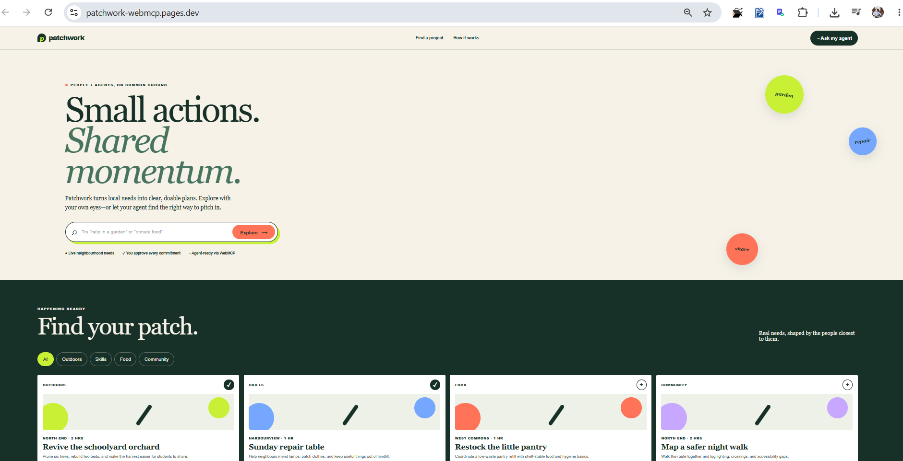
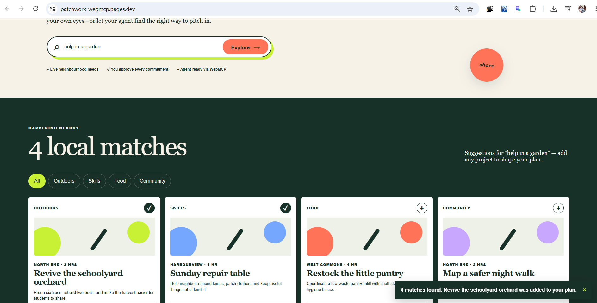
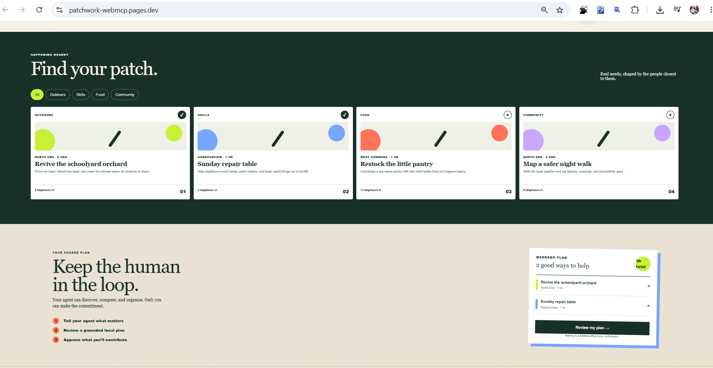
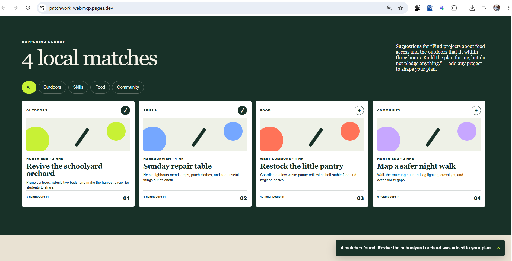
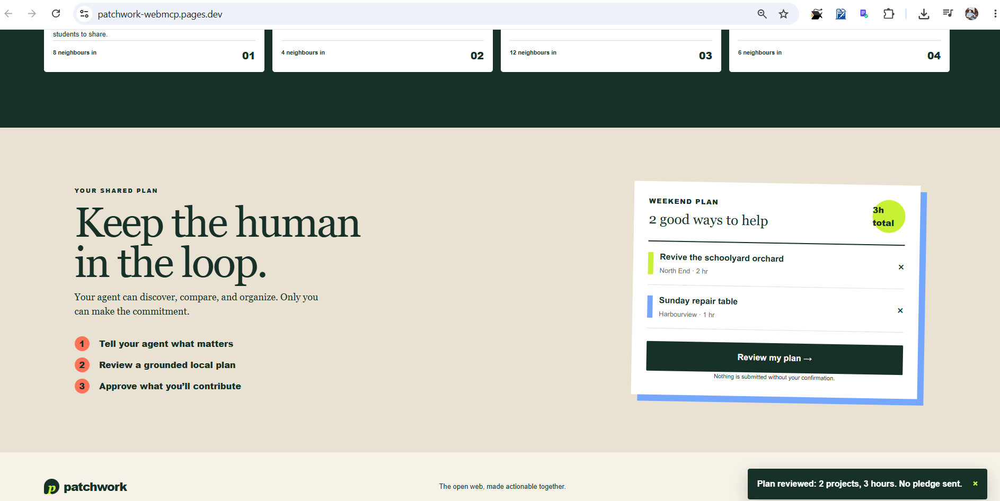
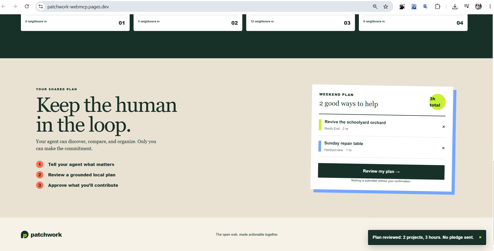
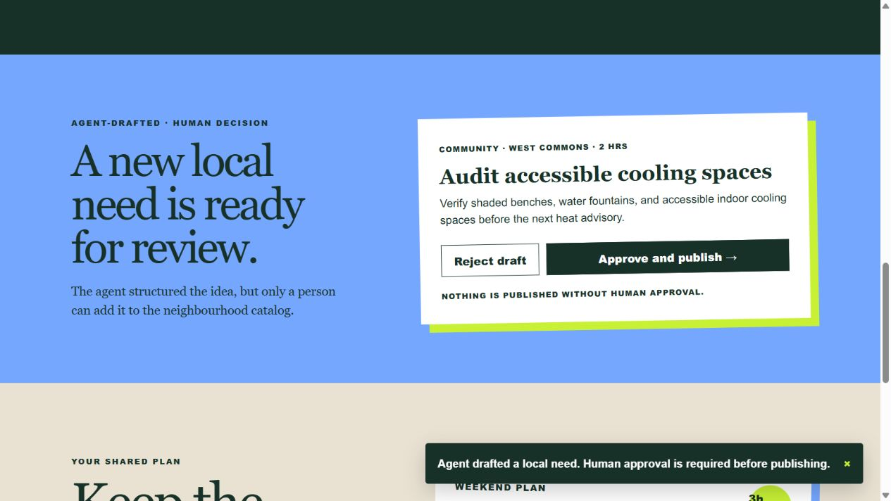
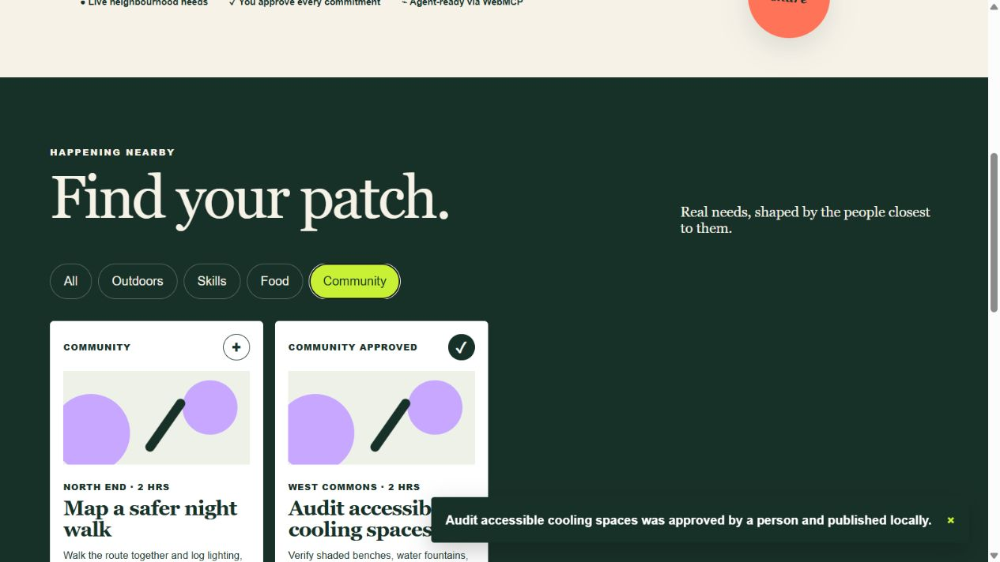

# Patchwork

**Small actions. Shared momentum.**

## Patchwork WebMCP

This [2:57 public demo video](https://youtu.be/c_RzlVBHSpg) showcases the [Patchwork public repository](https://github.com/lsantos2000/patchwork-webmcp) in response to the [WebMCP Challenge on Devpost](https://webmcp.devpost.com/?ref_feature=challenge).

Created by **Leonardo Santos-Macias** as an individual project. Patchwork is a WebMCP-powered neighbourhood planning prototype using demonstration projects. Agents prepare plans and project drafts; people review them. Pledges remain drafts, with no submission backend.

Built for the **WebMCP Challenge** (submissions close September 3 at 1:00 PM PT).

Patchwork and its WebMCP implementation were created during the August 25–September 3, 2026 submission period.

> **Browser testing:** See the complete [ChatGPT, Google Chrome WebMCP, and Claude review guide](resources/docs/browser-test.md).

## Quick links

- **Creator's LinkedIn announcement:** [Leonardo Santos-Macias on Patchwork WebMCP](https://lnkd.in/p/gtW7_PhS)
- **Live application:** [patchwork-webmcp.pages.dev](https://patchwork-webmcp.pages.dev/)
- **Demo video:** [YouTube](https://youtu.be/c_RzlVBHSpg) · [repository copy](resources/video/Patchwork_WebMCP_Judges_Demo.mp4)
- **Revised demo:** [Narrated MP4](resources/video/Patchwork_WebMCP_Judges_Demo.mp4) · [script, captions, and upload checklist](resources/video/DEMO_PRODUCTION.md). Individual submission; edited browser evidence, not a continuous recording. Uploaded to [YouTube](https://youtu.be/c_RzlVBHSpg); owner supplied the new link.
- **Browser and WebMCP testing:** [resources/docs/browser-test.md](resources/docs/browser-test.md)
- **Visual evidence:** [resources/images](resources/images)
- **Full demo transcript with slides:** [Narrated walkthrough](resources/video/DEMO_WALKTHROUGH.md)
- **All submission resources:** [resources](resources)
- **Claude workspace instructions:** [CLAUDE.md](CLAUDE.md)
- **Open-source license:** [MIT License](LICENSE)

## Judge it in 60 seconds

1. Open the [live application](https://patchwork-webmcp.pages.dev/) in ChatGPT's in-app browser or WebMCP-enabled Chrome.
2. Ask: **“Find food-access and outdoor projects that fit within three hours. Build a plan, but do not pledge anything.”**
3. Verify the visible results and three-hour Weekend Plan created through `search_neighborhood_projects` and `build_action_plan`.
4. Ask the agent to draft a new neighbourhood need. Verify that `propose_neighborhood_project` shows a review card but cannot publish until a person selects **Approve and publish**.
5. Ask for a pledge draft. Verify that `pledge_support` returns `confirmation_required` and nothing is submitted.

## Project description

### Why Patchwork is a strong fit for WebMCP

Finding a local opportunity is rarely a single lookup. People must interpret scattered descriptions, compare interests and time requirements, assemble a realistic plan, and decide what they are willing to contribute. Patchwork is a strong WebMCP use case because those steps map naturally to structured website capabilities: search current projects, combine selected records into a plan, and prepare a contribution for human review. The website remains the authoritative source of its data and supported actions, while the agent handles the coordination work.

### How it creates a better user experience

People can browse Patchwork normally or describe their intent conversationally—such as wanting to support food access and outdoor work within three hours. The agent can translate that request into structured searches and a visible weekend plan without scraping the page or guessing where to click. Every agent action is reflected in the same interface the person can inspect and edit, reducing repetitive comparison work without hiding what changed.

### What people and agents can do together

Before WebMCP, an agent would typically need to read rendered text, infer controls, and imitate a sequence of browser interactions. That approach is brittle and often separates the agent's answer from the website's actual state. With Patchwork, the agent can discover current opportunities, create a time-bounded plan, structure a new community need, and prepare a pledge draft through declared tools. The person can then adjust the same plan manually and remains the only party authorized to publish a proposed need or approve a commitment. This creates a shared workspace rather than a chatbot response beside an unrelated website.

### How WebMCP is implemented

Patchwork defines `search_neighborhood_projects`, `build_action_plan`, `propose_neighborhood_project`, and `pledge_support` in `app/page.tsx`. The reusable `app/useWebMCP.ts` hook registers them through `document.modelContext.registerTool({...})`, with a `navigator.modelContext` compatibility fallback, isolated registration errors, and `unregisterTool` cleanup. Tool handlers update the same React state used by the human interface and return structured results to the agent. Search and planning update local state directly. Project drafts need approval through a separate UI control before being saved to the device-local catalogue; pledges cannot be submitted.

### Device-local storage

Patchwork saves the current search, category filter, Weekend Plan, and human-approved community projects in the browser's `localStorage`. Human edits and plans created through `build_action_plan` use the same persistence path, so leaving, refreshing, or reopening the site in the same browser restores the shared workspace. The interface shows **Saved on this device** and provides a **Clear plan** control. Stored values are validated before restoration, and malformed or outdated values fall back safely to the default state.

Stored data includes searches, filters, project selections, and approved project text. Avoid entering credentials or sensitive personal information: free-text fields are saved on this device. Storage does not sync across browsers or devices and may be removed when site data is cleared or private browsing ends. Approved projects persist; pending proposals and pledge drafts do not. The plan tool returns `persisted_on_device: false` and `storage_status: pending` because storage writes happen afterward. The UI reports **Saved on this device** only after successful writes, or a session-only warning when storage is blocked or full.

## Why WebMCP

Local opportunity sites contain useful information, but people still have to search, compare schedules, and translate good intentions into a practical plan. Patchwork exposes the same project data and actions that people see in the interface as structured WebMCP tools. A compatible agent can therefore search by interest or time, combine projects into a plan, and draft a pledge without scraping or guessing.

The critical boundary is deliberate: the agent can prepare a pledge, but `pledge_support` returns `confirmation_required`. The person remains responsible for every commitment.

## What people and agents can do together

- Browse and filter current neighbourhood projects in a friendly visual interface.
- Ask an agent to find opportunities that match a topic, location, or time budget.
- Turn several opportunities into one achievable weekend plan.
- Draft a contribution while preserving a clear human confirmation step.
- See and edit the same plan whether it was assembled manually or by an agent.

### Pledge review and AI-tool disclosure

A valid `pledge_support` request displays the project and contribution in a review card. **Mark draft reviewed** acknowledges it locally; **Dismiss pledge draft** removes it. Neither action submits a pledge. Unknown projects, blank contributions, and contributions over 1,000 characters are rejected. Drafts and review status disappear on reload.

Development used **OpenAI Codex**, **Google Gemini** (owner-confirmed), and **Piper TTS** for video narration. These development tools are distinct from the browser client used for recorded native WebMCP testing.

## WebMCP tools

Agent searches reset the category to **All** and apply the same per-project time limit to both tool results and visible cards. An active limit appears as an **Up to … hr per project** button; click it to clear the limit. Manual category changes refine those results. **Show every project** clears all search constraints. The time limit is saved on this device alongside the query and category.

Patchwork defines four tools in `app/page.tsx` and registers them through the reusable `app/useWebMCP.ts` hook using `document.modelContext.registerTool(...)`:

| Tool | Purpose | Safety behavior |
| --- | --- | --- |
| `search_neighborhood_projects` | Search by free text and per-project maximum hours | Updates the local search state; no external commitment |
| `build_action_plan` | Combine project IDs, calculate total time, update the UI, and save the plan on this device | Changes the local plan; no external commitment |
| `propose_neighborhood_project` | Structure a new community need and display it for review | Returns `human_approval_required`; cannot publish |
| `pledge_support` | Prepare a contribution pledge | Returns `confirmation_required`; does not submit |

## How the agent works

Patchwork does not embed a chatbot or run its own AI model. It exposes safe, structured WebMCP capabilities to an agent operating in a compatible browser, such as ChatGPT's in-app browser.

```text
Person asks the browser agent
            ↓
Agent discovers Patchwork's WebMCP tools
            ↓
Agent calls a tool with structured input
            ↓
Patchwork updates the shared visible interface
            ↓
Person reviews the result and approves any commitment
```

The browser loads Patchwork and `useWebMCP` detects an available model context. The hook registers the four tools and delegates calls to their handlers. Handlers normalize or validate selected input fields, update shared React state, and return structured results; the hook is not a general JSON Schema validator. It also unregisters the tools when the page is removed. The hook supports both `document.modelContext` and the compatible `navigator.modelContext` surface.

The collaboration is intentionally divided by risk:

- `search_neighborhood_projects` lets an agent find projects by interest, location, or time budget. Matching results are displayed in the page.
- `build_action_plan` lets the agent assemble project IDs into a shared weekend plan and calculate its total time. The person can continue editing that plan manually.
- `propose_neighborhood_project` lets the agent structure a local need, but the draft remains outside the catalog until a person explicitly approves it.
- `pledge_support` may prepare a proposed contribution, but it cannot finalize it. It returns `confirmation_required` and asks the person to approve the consequential action.

In other words, an agent may search and organize, but it may not commit a person's time without that person's confirmation. The website defines the available operations and their schemas, so the agent does not need to scrape text, guess coordinates, or imitate button clicks.

Try this prompt in a WebMCP-compatible browser:

> Find neighbourhood projects related to gardening or food that take no more than two hours. Build me a weekend action plan, but ask me before pledging my time.

The expected collaboration is **search → visible results → shared plan**. Ask separately for a pledge draft to demonstrate `confirmation_required`; there is no pledge-submit action. The **Try an example plan** button loads a predefined example plan and explicitly states that no agent was called.

## Run locally

### Requirements

- Node.js 22.13 or newer
- pnpm available on PATH when using `PLAYWRIGHT_USE_LOCAL=1` (the test configuration starts `pnpm dev`)
- npm 10 or newer

### Setup

```bash
npm install
npm run dev
```

Open [http://localhost:3000](http://localhost:3000).

To test the WebMCP tools, use ChatGPT's in-app browser or Chrome 149+ with `chrome://flags/#enable-webmcp-testing` enabled.

For exact prompts, expected tool calls, Claude review instructions, recording requirements, troubleshooting, and pass criteria, follow the complete [browser-test guide](resources/docs/browser-test.md).

### Test persistence

1. Add or remove projects from the Weekend Plan.
2. Refresh the page or navigate away and return.
3. Confirm that the search, category, selected projects, and total hours are restored.
4. Use **Clear plan**, refresh again, and confirm that the empty plan remains saved.
5. Prepare a pledge draft and confirm that it still requires fresh human approval rather than being restored as approved.

### Playwright tests

The `tests/` folder contains 50 focused TypeScript checks organized into `unit/`, `e2e/`, and reusable `fixtures/`. They verify project-domain rules, production styling, all four WebMCP registrations through a controlled model-context test shim, valid and malformed tool inputs, agent-to-UI state updates, proposal approval and rejection, device-local restoration and corruption recovery, keyboard accessibility, responsive layouts, human plan controls, and the pledge confirmation boundary.

```bash
npm install
npm run test:e2e:install
npm run test:e2e
```

Set `PLAYWRIGHT_USE_LOCAL=1` to let Playwright start and test the current source, or set `PLAYWRIGHT_BASE_URL` to test another deployment. GitHub Actions tests the checked-out source on pushes and pull requests to `main`, retaining its HTML report when the job completes. With neither variable set, the suite targets the public Cloudflare Pages URL.

Six additional offline PowerShell cases exercise the publishing helper without running real Git or GitHub commands: clean and dirty trees, mismatched remotes, inaccessible repositories, commit failures, and push failures. Run `pwsh -NoProfile -File tests/scripts/publish-github.test.ps1`; CI runs these separately from Playwright.

### Production build

```bash
npm run build:pages
```

The application is designed for the Cloudflare runtime and is deployed to Cloudflare Pages for the challenge.

## Publish the repository safely

The included PowerShell helper checks the staged source for common credential patterns before it commits or pushes:

```powershell
.\scripts\publish-github.ps1 -RepoName patchwork-webmcp -Owner lsantos2000
```

It requires GitHub CLI (`gh`) and will request authorization if needed. It pushes the current branch, validates the destination remote, and stops on failed Git commands. Creating a new public repository requires the explicit `-CreateRepository` switch. No token is stored in the script or repository.

## Claude Code workspace

The repository includes a judge-focused `.claude/` workspace with:

- `webmcp-architect`, `hackathon-judge`, and isolated `release-engineer` subagents
- reusable `webmcp-review` and `judge-readiness` skills
- shared WebMCP, safety, accessibility, and release rules
- `/judge-swarm` and `/release-check` project commands
- conservative permissions that deny secret files and destructive Git operations

Run `/judge-swarm` in Claude Code for independent parallel reviews. The release engineer uses worktree isolation so implementation tasks do not modify the main checkout until reviewed.

## Submission checklist

- [x] Responsive, interactive web experience
- [x] Discoverable WebMCP tools
- [x] Human confirmation before consequential action
- [x] Cloudflare-compatible production build
- [x] Public source with setup instructions
- [x] Open-source license
- [x] Public live URL verified in a WebMCP-compatible browser
- [x] Owner supplied the final YouTube upload; local MP4 verified at 2:57
- [ ] Confirm the final upload is Public, audible, and playable while logged out
- [ ] Devpost text and links submitted

## Visual evidence

Screens 1–5 are supplied screenshots of the public deployment and show visible UI states, not proof of native tool calls. Screens 6 and 7 came from a native WebMCP proposal call followed by a Playwright-controlled approval-button interaction. Additional native tool inputs/results are saved in [the evidence JSON](resources/video/demo-assets/webmcp-evidence.json).

### 1. Human-first discovery



Patchwork gives people a complete visual experience before an agent is involved: a clear prompt, demonstration neighbourhood projects, and a visible review boundary.

### 2. Intent-aware project results



People can filter and compare outdoors, skills, food, and community opportunities without leaving the page.

### 3. Human-editable shared plan



Selected projects appear in one weekend plan with a visible time total. The person can add or remove projects at any time.

### 4. Agent request to shared plan



The request for food-access and outdoor projects is reflected in the same project interface used by the person.



The resulting two-project plan totals three hours and remains editable. These still images demonstrate the shared visible state; the demo video should additionally show the live `build_action_plan` WebMCP invocation.

### 5. Human confirmation boundary



Reviewing a plan does not submit a pledge. Patchwork states both **“Nothing is submitted without your confirmation”** and **“No pledge sent.”**

### 6. Agent-drafted need, awaiting a human decision



The browser agent invoked `propose_neighborhood_project` with structured data. Patchwork returned `human_approval_required`, placed the complete draft in the shared interface, and kept it outside the device-local catalogue. Both **Reject draft** and **Approve and publish** remain person-controlled actions.

### 7. Human-approved community project



The test exercised **Approve and publish** using browser automation, after which the new need joined the device-local catalogue and plan. The UI labels **Community approved** and **Approved by a person** express the intended workflow; this automated capture does not establish that a human personally clicked the control.

## How to demo it

Use ChatGPT's in-app browser or WebMCP-enabled Chrome and open the live Pages URL.

### Human flow

1. Enter **“help in a garden”** in the main search and select **Explore**.
2. Patchwork scrolls to the matching orchard project, adds it to the weekend plan, and reports what changed.
3. Try **“donate food”**, **“fix clothes”**, or **“safer streets”** to demonstrate intent-aware matching.
4. Use the category chips and `+` buttons to edit the plan manually.
5. Select **Review my plan** to show the total hours and the no-commitment safety message.

### Agent flow

Give the browser agent this exact prompt:

> Find neighbourhood projects I can help with this weekend in three hours or less. I care about food access and the outdoors. Build a plan, but do not make any pledge without asking me first.

The expected tool sequence is:

1. `search_neighborhood_projects` finds relevant records. Its hour limit applies to each project, not the whole plan.
2. The agent chooses a combination within the requested total budget; `build_action_plan` reports the selected records and total hours.
3. Separately ask: **Draft a two-hour Community project in West Commons called Map accessible shade. Describe checking shaded benches and accessible cooling spaces. Do not publish it.** Verify the proposal review card.
4. Approve or reject the proposal using the visible controls. Approval saves it only on this device.
5. Separately ask: **Prepare a pledge draft for the pantry project, but do not submit it.** Verify `confirmation_required`; no pledge is sent.

> **Browser-test note:** The exact ChatGPT in-app browser steps, Chrome WebMCP setup, Claude review instructions, evidence requirements, and pass criteria are maintained in [`resources/docs/browser-test.md`](resources/docs/browser-test.md).

### Final judging video — 2:57

Watch the [final Patchwork WebMCP demo](https://youtu.be/c_RzlVBHSpg), created by **Leonardo Santos-Macias**. This sequence follows the final narrated walkthrough; timestamps below are rounded to the nearest second.

1. **0:00 — Introduction:** Small actions. Shared momentum. An individual project exploring people and agents working together.
2. **0:13 — The problem:** turn good intentions into a practical neighbourhood plan, using a clearly identified demonstration catalogue.
3. **0:28 — Why WebMCP:** four structured tools, an external browser agent, and captured native tool results.
4. **0:44 — Search:** `search_neighborhood_projects` returns orchard and pantry records for a gardening-and-food request.
5. **1:01 — Shared plan:** `build_action_plan` selects two projects totaling three hours in the shared React interface.
6. **1:17 — Propose a local need:** the agent drafts **Map accessible shade**; `propose_neighborhood_project` returns `human_approval_required` and `published: false`.
7. **1:32 — Review and restore:** browser automation exercises the separate approval control, then verifies device-local persistence after reload.
8. **1:48 — Pledge safety:** `pledge_support` returns `confirmation_required`. No pledge is submitted and no organizer is contacted.
9. **2:05 — Implementation:** React, TypeScript, Vinext, Cloudflare Pages, tool registration and cleanup, and local storage.
10. **2:22 — Testing and open source:** the video describes the earlier 39-check validated run, distinguishes shim tests from native evidence, and explains Codex's contribution. The current suite has since expanded; see the Playwright tests section for current coverage.
11. **2:41–2:57 — Closing:** try the live app, inspect the public source and MIT license, and keep the final decision with the person.

The video uses edited still-frame browser evidence and synthetic narration; it is not a continuous screen recording. See the [complete audio transcript with all 11 slide images and precise timestamps](resources/video/DEMO_WALKTHROUGH.md), [captions](resources/video/Patchwork_WebMCP_Judges_Demo.srt), and [saved MP4](resources/media/Patchwork_WebMCP_Judges_Demo.mp4).

## License

MIT — see [LICENSE](LICENSE).
