# Patchwork — narrated demo walkthrough

Individual project by Leonardo Santos-Macias. Duration: approximately **2:31** (under 3 minutes).

This document pairs all 11 corrected video slides with the complete spoken narration. Slide numbering runs from 01 to 11; section labels do not use a competing counter. Images load from `../images/demo-walkthrough/`.

This is edited still-frame browser evidence with synthetic narration, not a continuous screen recording. Native WebMCP result excerpts were captured from the deployed application; automated UI captures are identified separately.

[Watch the refreshed local MP4](Patchwork_WebMCP_Judges_Demo.mp4) · [Captions](Patchwork_WebMCP_Judges_Demo.srt) · [YouTube description](YOUTUBE_DESCRIPTION.md) · [Production notes](DEMO_PRODUCTION.md) · [Technical validation](demo-validation.json)

The refreshed negotiated-planning cut is a local upload candidate. The existing [public YouTube video](https://youtu.be/c_RzlVBHSpg) is the earlier Discover-focused cut and remains the submission link until the owner uploads this replacement and supplies its new URL.

## 01 / 11 — PATCHWORK / WEBMCP CHALLENGE

Starts at `00:00:00,000`.

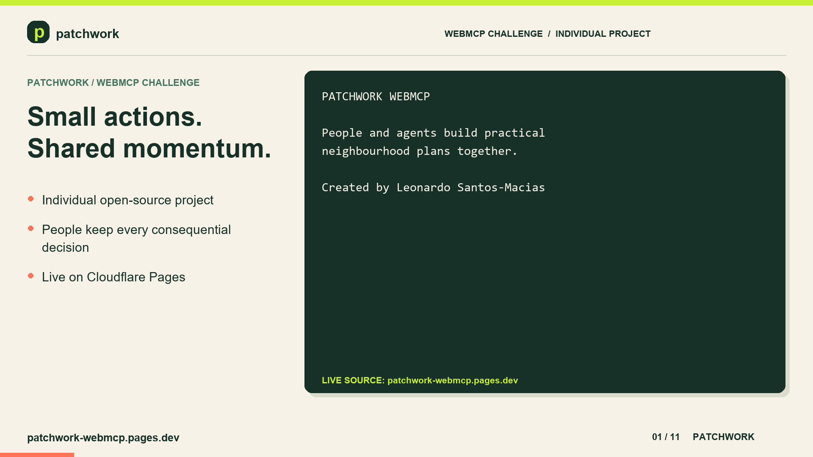

### Audio transcript

Patchwork is a WebMCP-powered neighbourhood action exchange, created by Leonardo Santos-Macias. It helps people and browser agents turn good intentions into realistic plans while keeping consequential decisions explicitly human-controlled.

## 02 / 11 — THE PROBLEM

Starts at `00:00:15,667`.

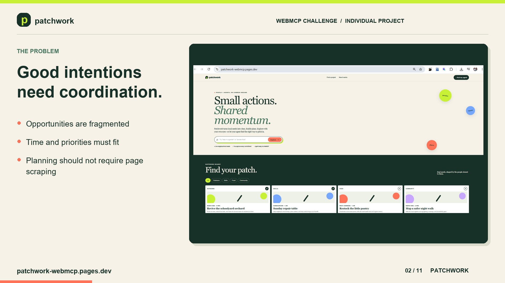

### Audio transcript

Finding a useful way to help still means searching listings, comparing time, and translating intent into a practical next step. Patchwork provides one visible workspace backed by structured demonstration records.

## 03 / 11 — DISCOVER

Starts at `00:00:28,500`.

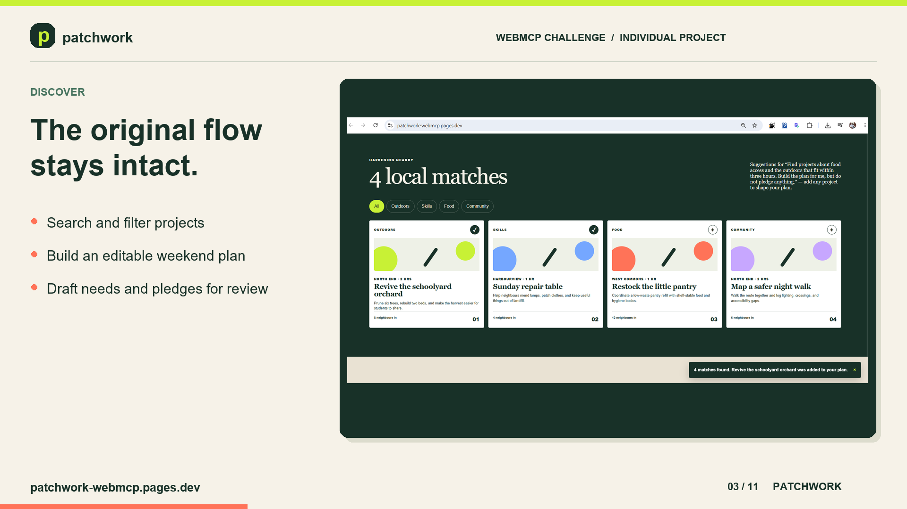

### Audio transcript

Discover keeps the original experience. Four WebMCP tools let an external browser agent search projects, assemble a visible plan, draft a neighbourhood need, and prepare a pledge without embedding another chatbot.

## 04 / 11 — PLAN TOGETHER

Starts at `00:00:42,042`.

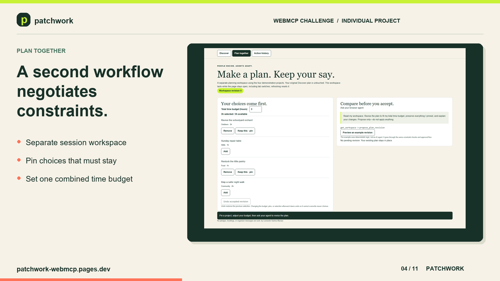

### Audio transcript

Plan together adds a separate session workspace. The person can pin projects, set a combined time budget, and ask the agent to revise around those constraints without changing the saved Discover plan.

## 05 / 11 — SCOPED NATIVE WEBMCP

Starts at `00:00:53,833`.

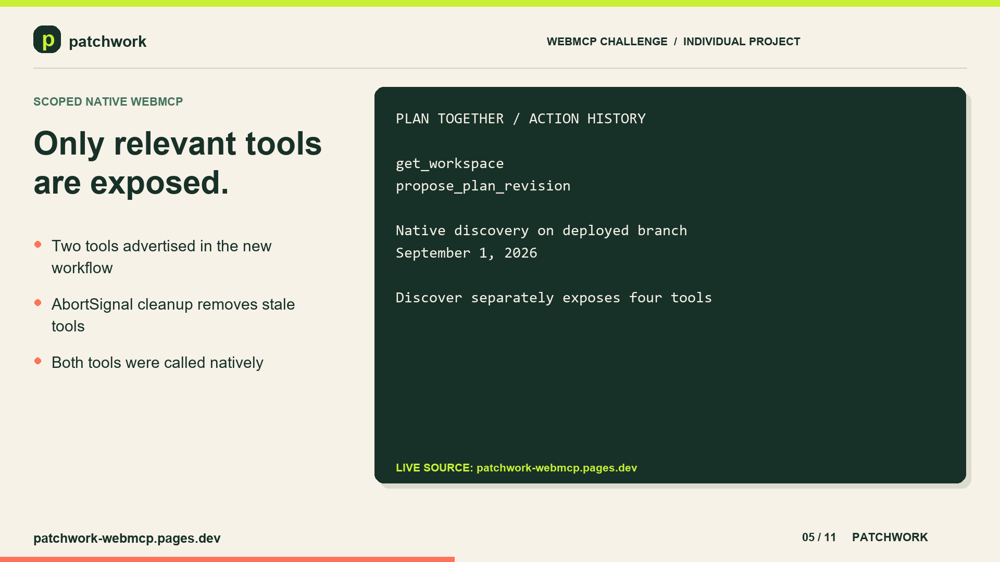

### Audio transcript

In the deployed branch, the Codex in-app browser natively discovered exactly two tools after the tab switch: get workspace and propose plan revision. AbortSignal cleanup prevents tools from an inactive workflow remaining advertised.

## 06 / 11 — BEFORE / AFTER DIFF

Starts at `00:01:08,583`.

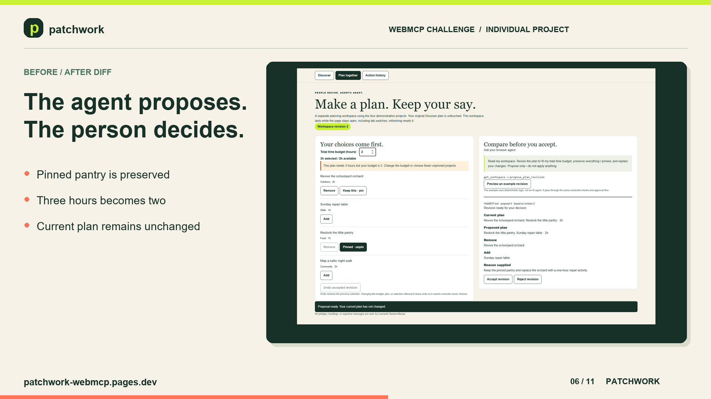

### Audio transcript

The agent reads revision two, preserves the pinned pantry, and proposes replacing the orchard with the one-hour repair table. Patchwork shows the full before-and-after difference. Nothing changes until Accept revision is selected.

## 07 / 11 — ACTION HISTORY

Starts at `00:01:22,167`.

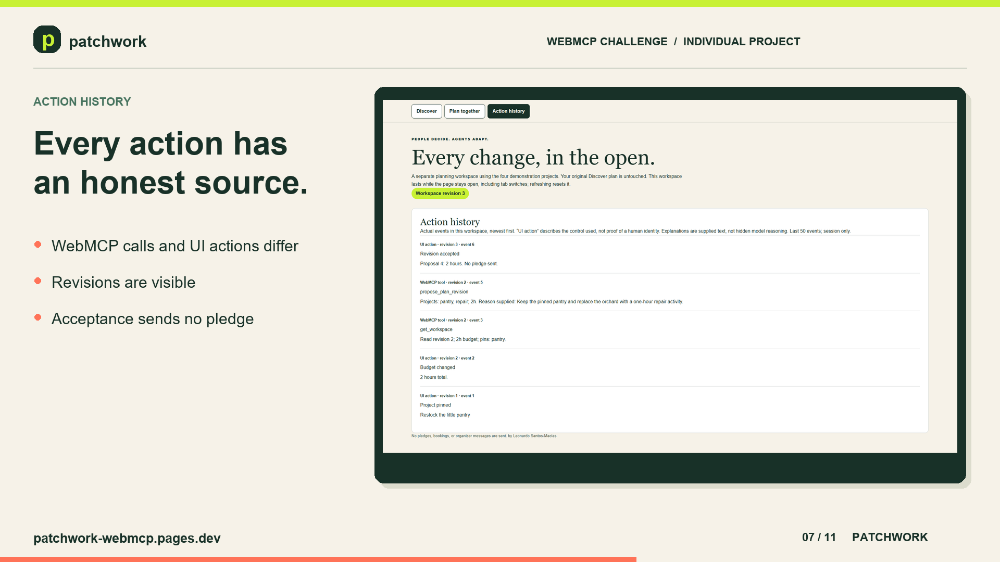

### Audio transcript

Action history distinguishes WebMCP tool calls from interface actions and records the workspace revision. It is intentionally described as a bounded local history, not proof of identity or a tamper-proof audit log.

## 08 / 11 — CONSTRAINT CONFLICT

Starts at `00:01:36,000`.

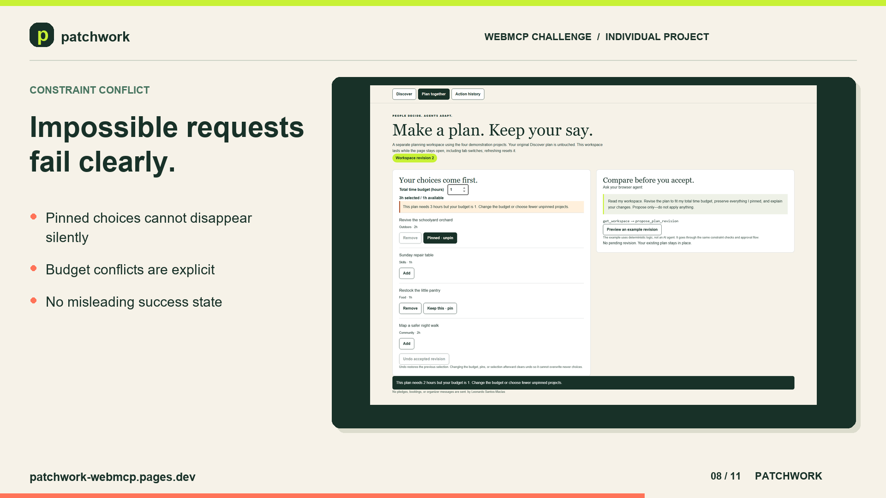

### Audio transcript

When the two-hour orchard is pinned inside a one-hour budget, the tool reports a constraint conflict. It does not silently remove the person's choice or claim that an impossible plan succeeded.

## 09 / 11 — HUMAN SAFETY BOUNDARY

Starts at `00:01:47,333`.

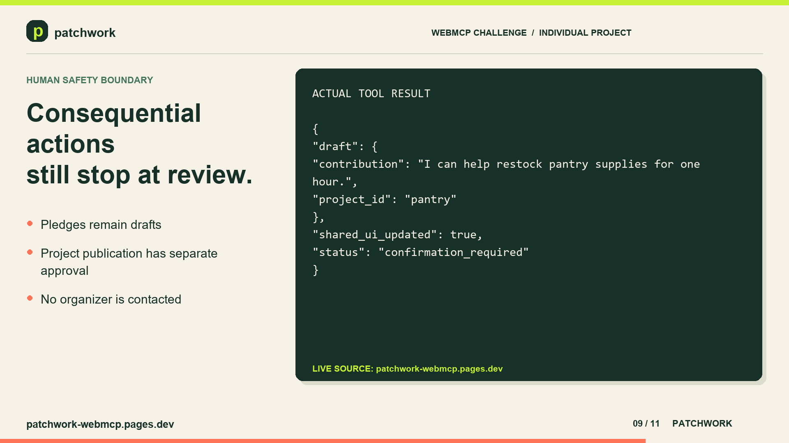

### Audio transcript

The original safety boundary remains. Pledge support returns confirmation required and never contacts an organizer. Proposed community needs also require a separate visible approval action before device-local publication.

## 10 / 11 — IMPLEMENTATION / EVIDENCE

Starts at `00:02:01,292`.

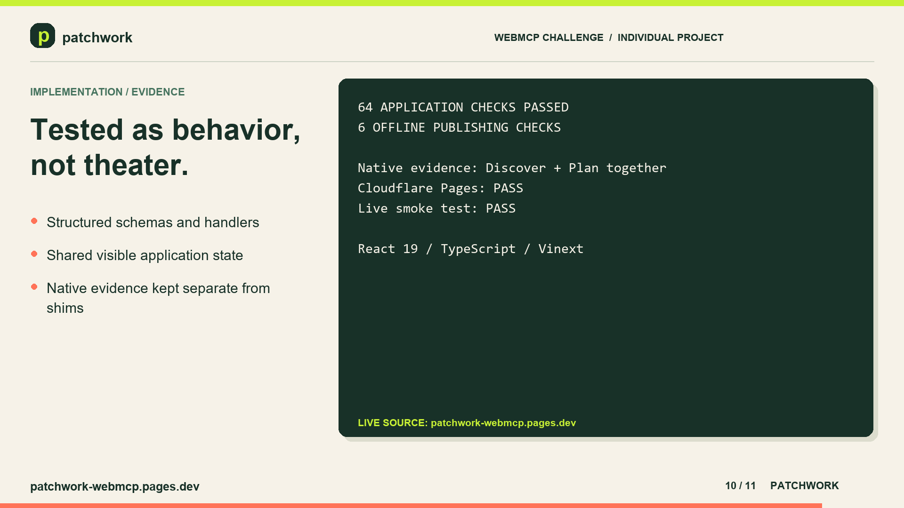

### Audio transcript

The project uses React, TypeScript, and Vinext on Cloudflare Pages. Sixty-four application checks cover both workflows. Native browser records remain separate from shim-based automation, and the branch deployment and live smoke test passed.

## 11 / 11 — PATCHWORK / TRY IT YOURSELF

Starts at `00:02:17,375`.

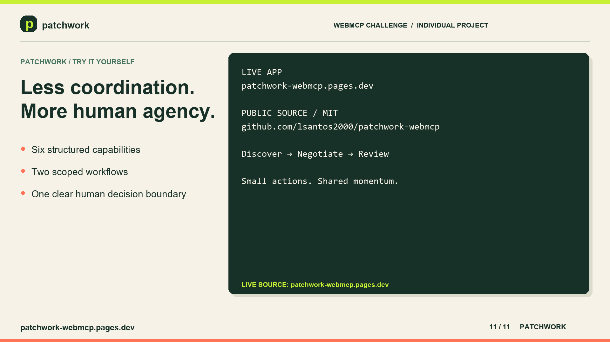

### Audio transcript

Patchwork shows a future open web where agents reduce coordination work without taking away human agency. Open the live site, inspect the public source, and try both documented workflows. Small actions. Shared momentum.

## Watch the complete video

- [Open or download the refreshed local MP4](../media/Patchwork_WebMCP_Judges_Demo.mp4)
- [Download refreshed captions](Patchwork_WebMCP_Judges_Demo.srt)
- [Watch the earlier public Discover-focused cut](https://youtu.be/c_RzlVBHSpg)

Duration: **2:31**. The `resources/media/` copy is the refreshed negotiated-planning upload candidate; it is not yet the file streamed at the existing YouTube URL.

The refreshed video is an edited screenshot walkthrough with synthetic narration and native WebMCP result excerpts, not a continuous screen recording. It credits Leonardo Santos-Macias. Review it locally, upload it as a new public YouTube video, then replace the earlier link throughout the documentation.
